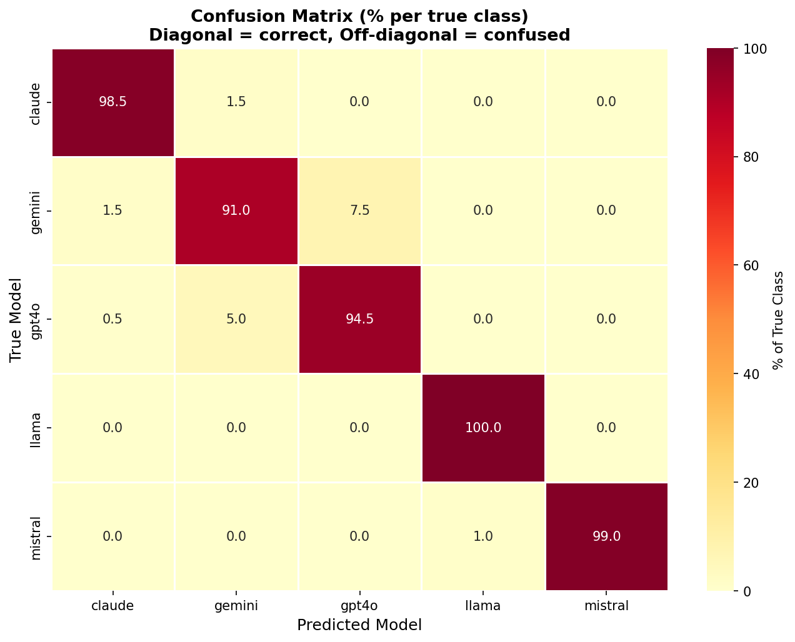
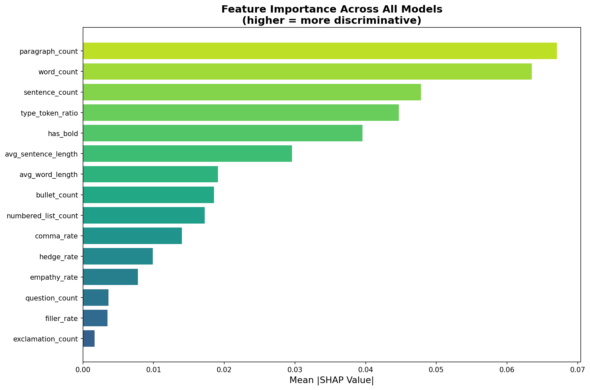
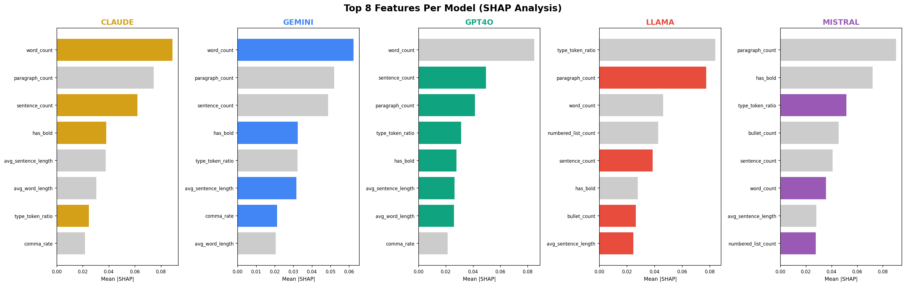

# 🔍 AI Model Fingerprinter

> Can you identify which LLM wrote a piece of text — with no hints, no metadata, just the text itself?

A machine learning system that classifies text as written by **GPT-4o, Claude 3.5, Gemini 1.5, LLaMA 3.1, or Mistral Large** using linguistic fingerprinting.

---

## 🎯 Results

| Metric | Score |
|--------|-------|
| Classifier Accuracy | **97%** |
| Post-Paraphrase Attack | **44%** |
| Post-Style-Transfer Attack | **29%** |
---

## 🛠️ How It Works

1. **Dataset**: 1,000 LLM responses (200 prompts × 5 models)
2. **Features**: 15 linguistic features — lexical, syntactic, semantic
3. **Classifier**: Random Forest trained on feature vectors
4. **Demo**: Streamlit app with confidence scores + feature attribution

---

## 📁 Project Structure

```
├── app/app.py               # Streamlit demo
├── data/dataset.csv         # 1000 labeled responses
├── features/                # Feature extraction pipeline
├── models/                  # Trained classifiers + visualizations
├── adversarial_testing.py   # Robustness testing
├── shap_analysis.py         # Interpretability analysis
└── train_classifier.py      # Model training
```

---

## 🚀 Run Locally

```bash
git clone https://github.com/YOUR_USERNAME/ai-model-fingerprinting
cd ai-model-fingerprinting
pip install -r requirements.txt
python -m spacy download en_core_web_sm
streamlit run app/app.py
```

---

## 🔬 Key Findings (SHAP Analysis)

- **Claude 3.5** is most identifiable by: high em-dash usage, subordinate clause depth
- **GPT-4o** is fingerprinted by: consistent bullet-point structuring, low hedge rate
- **LLaMA 3.1** shows: highest type-token ratio, broadest vocabulary diversity
- Hardest pair to distinguish: [fill in after SHAP analysis]

---

## ⚔️ Adversarial Robustness

| Attack | Accuracy |
|--------|----------|
| Original | XX% |
| Paraphrase Attack | XX% |
| Style Transfer Attack | XX% |

---

## 📊 Visualizations




---

Built as part of AIML Club Monthly Project Challenge.